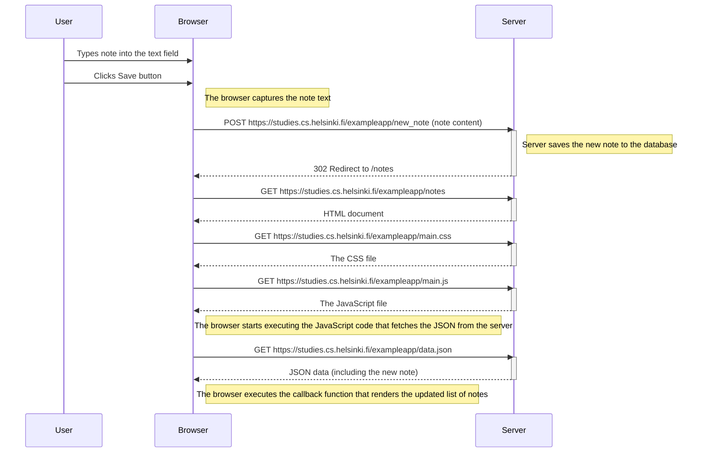

```mermaid
sequenceDiagram
    participant User
    participant Browser
    participant Server

    User->>Browser: Types note into the text field
    User->>Browser: Clicks Save button
    Note right of Browser: The browser captures the note text

    Browser->>Server: POST https://studies.cs.helsinki.fi/exampleapp/new_note (note content)
    activate Server
    Note right of Server: Server saves the new note to the database
    Server-->>Browser: 302 Redirect to /notes
    deactivate Server

    Browser->>Server: GET https://studies.cs.helsinki.fi/exampleapp/notes
    activate Server
    Server-->>Browser: HTML document
    deactivate Server

    Browser->>Server: GET https://studies.cs.helsinki.fi/exampleapp/main.css
    activate Server
    Server-->>Browser: The CSS file
    deactivate Server

    Browser->>Server: GET https://studies.cs.helsinki.fi/exampleapp/main.js
    activate Server
    Server-->>Browser: The JavaScript file
    deactivate Server

    Note right of Browser: The browser starts executing the JavaScript code that fetches the JSON from the server

    Browser->>Server: GET https://studies.cs.helsinki.fi/exampleapp/data.json
    activate Server
    Server-->>Browser: JSON data (including the new note)
    deactivate Server

    Note right of Browser: The browser executes the callback function that renders the updated list of notes
```
