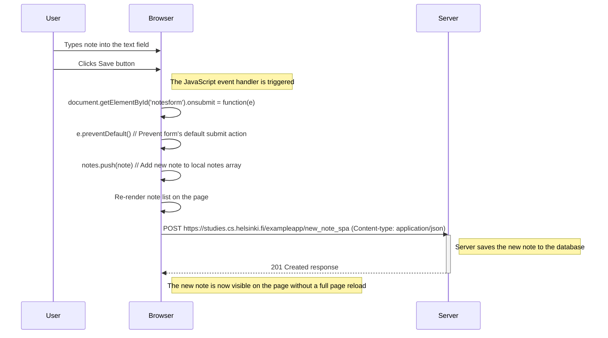

```mermaid
sequenceDiagram
    participant User
    participant Browser
    participant Server

    User->>Browser: Types note into the text field
    User->>Browser: Clicks Save button

    Note right of Browser: The JavaScript event handler is triggered

    Browser->>Browser: document.getElementById('notesform').onsubmit = function(e)
    Browser->>Browser: e.preventDefault() // Prevent form's default submit action
    Browser->>Browser: notes.push(note) // Add new note to local notes array
    Browser->>Browser: Re-render note list on the page

    Browser->>Server: POST https://studies.cs.helsinki.fi/exampleapp/new_note_spa (Content-type: application/json)
    activate Server
    Note right of Server: Server saves the new note to the database
    Server-->>Browser: 201 Created response
    deactivate Server

    Note right of Browser: The new note is now visible on the page without a full page reload
```
